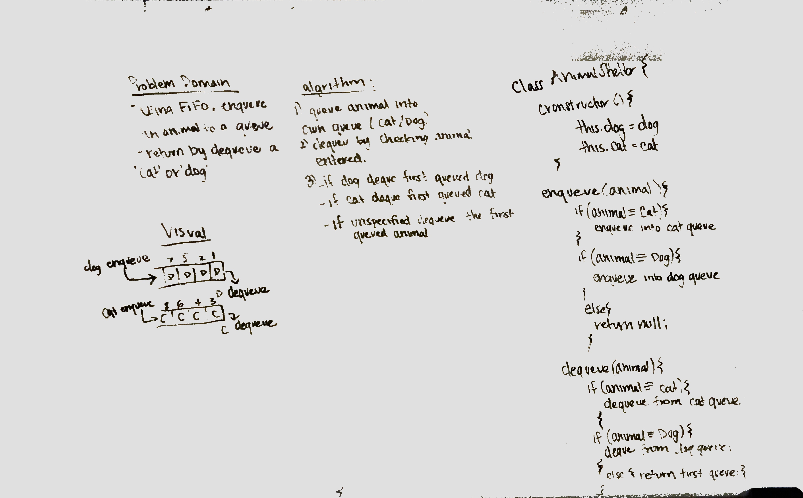

# enqueue-dequeue

## Challenge Description
create a class called animalShelter that holds only dogs and cats, It uses FIFO apporach 

## Approach & Efficiency
pushed into two different animal queues (dog/cat) to keep 0(1) time
dequeue first animal in depending on what animal was needed.
if animal wasnt specified, then the first animal that was queued would be dequeued..

## Solution
